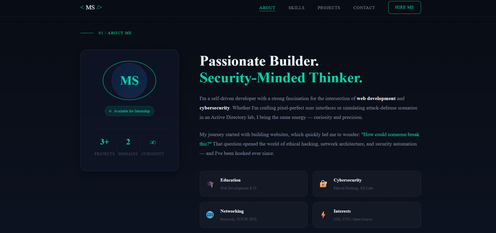
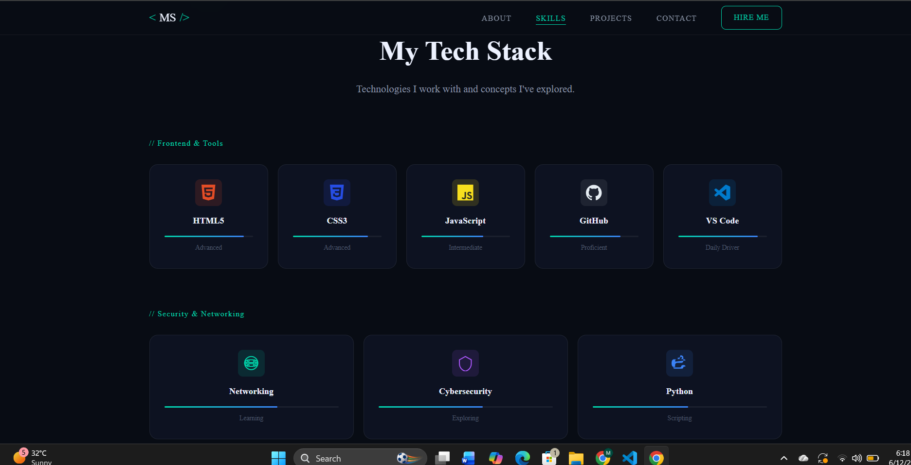
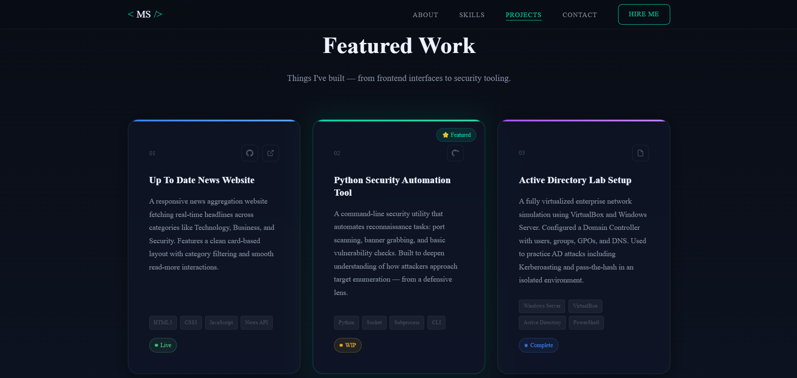
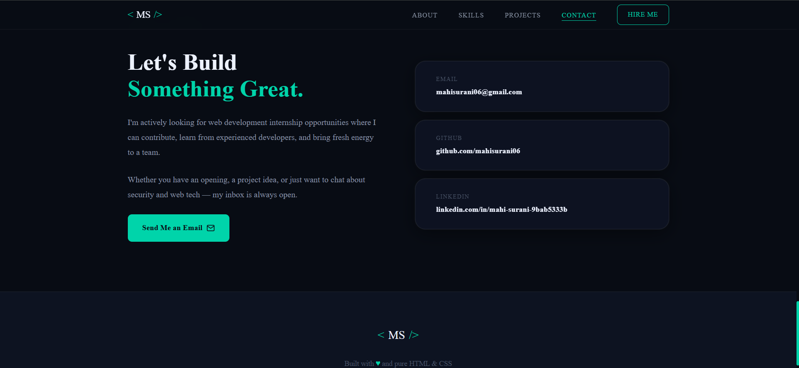

# 🚀 Mahi Surani — Personal Portfolio Website

## Objective

Develop a responsive personal portfolio website to showcase skills, projects, education, certifications, and contact information as part of the Synent Technology Web Development & Design Internship.

## Technologies Used

* HTML5
* CSS3
* JavaScript

## Features

* Modern and responsive design
* Professional landing page
* About Me section
* Skills showcase
* Projects section
* Contact information
* Mobile-friendly layout

---

## 📁 Folder Structure

```
mahi-portfolio/
├── index.html        ← Single-page HTML (all sections)
├── style.css         ← Complete stylesheet (~700 lines)
└── README.md         ← This file
```
## Screenshots

### About Page



### Skills Section



### Projects Section



### Contact Section



## Project Outcome

Successfully developed a professional portfolio website that highlights my technical skills, projects, and achievements while improving my frontend development and responsive design skills.

### Live Demo
file:///C:/Users/VICTUS/OneDrive/Documents/Synent-Web-Development-Internship/Task1%20Portfolio-Website/index.html

## Author

Mahi Surani

GitHub: https://github.com/mahisurani06

LinkedIn: https://www.linkedin.com/in/mahi-surani-9bab5333b/
